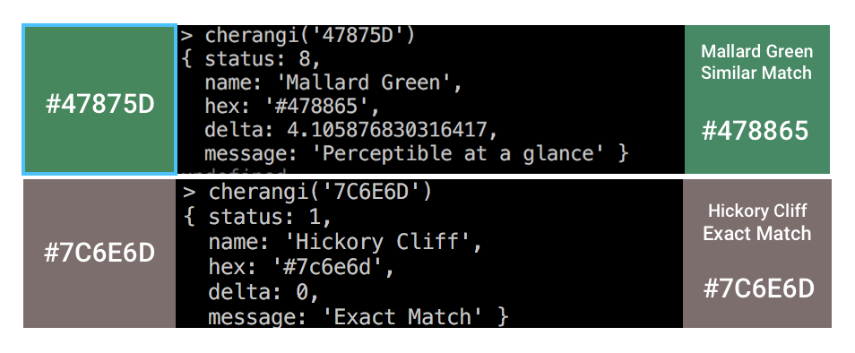

# Cherangi 
A small javascript library that helps you find the name of a color (Over 10000 color names).




## Install

```
$ npm install --save cherangi
```


## Usage

```js
const cherangi = require('cherangi');

cherangi('#cfcfcf');

```
### About Returned Object
The returned value holds the color information and
if consists of a `status` , `name`, `hex`, `delta` and a `message`

#### Status
Holds the status information of the results which could be one of the following

| Status Code |   Status Description                      |
|-------------|-------------------------------------------|
| 0           |   Exact Match                             |
| 2	          |   Not perceptible by human eyes.          |
| 4	          |   Perceptible through close observation.  |
| 8	          |   Perceptible at a glance.                |
| -1          |   No Color match found                    |


#### Name
A `<string>` that represents the color name of the input value if no exact match has been found then the most similar color will be returned.

#### Hex
A `<string>` that returns the matched color / similar color code in hex

#### Delta (E 76)
Delta E is a metric for understanding how the human eye perceives color difference. The term delta comes from mathematics, meaning change in a variable or function. The suffix E references the German word Empfindung, which broadly means sensation.
- Source: http://zschuessler.github.io/DeltaE/learn/#toc-defining-delta-e

#### Message
A `<string>` to show the description of the current result.

#### Returned Object (Sample)
* Valid
```
{
	status: 8,
	name: 'Neon Green',
	hex: '#39ff14',
	delta: 2.8270216256677023,
	message: 'Perceptible at a glance'
}
```      

* Invalid Input
For now all invalid inputs are handled as black color. This will be changed with a proper staus code in near future
```
{
	status: 1,
	name: 'Black',
	hex: '#000000',
	delta: 0,
	message: 'Exact Match'
}
```

## CLI

```
$ npm install --global cherangi
```

```
$ cherangi --help

  Usage
    cherangi 'hexcode'
    cherangi '#hexcode'

  Example
    cherangi 'fff'
    cherangi '#fcfcfc'
```

## Thanks to
* [David Aerne](https://github.com/meodai/color-names)  for the awesome list of color names.
* [EasyRGB.com](http://www.easyrgb.com/en/math.php) for providing the formulas
* [Zachary Schuessler](https://github.com/zschuessler) for the helpful blog about [Delta](http://zschuessler.github.io/DeltaE/learn/#toc-defining-delta-e) 
